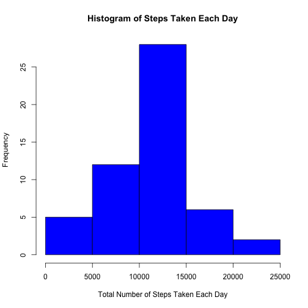
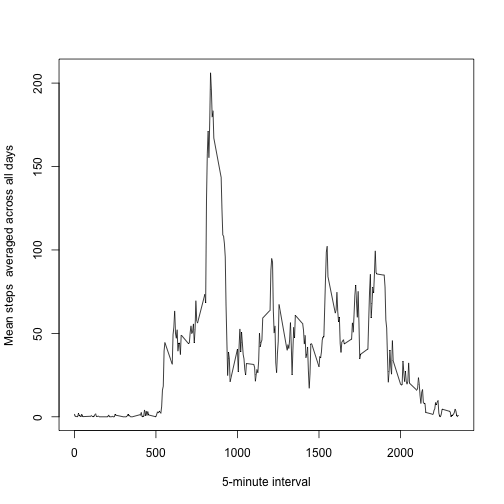
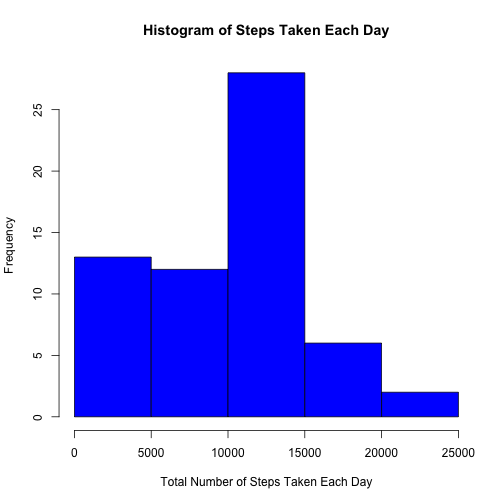
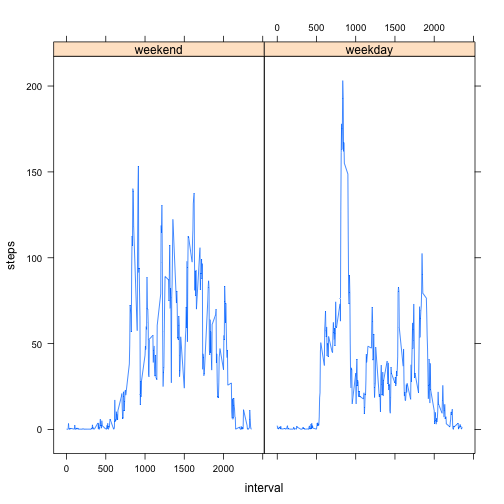

Reproducible Research Peer Assignment 1 
========================================================

The data for this assignment looks at activity levels from a personal monitoring device, which collected the number of steps taken at a 5-minute interval for October and November 2012.

Here, I load and read in the above described data. 

```r
data <- read.csv("activity.csv")
```


### What is mean total number of steps taken per day?

```r
byDateStats <- tapply(data$steps, data$date, FUN = sum)
hist(byDateStats, main = "Histogram of Steps Taken Each Day", xlab = "Total Number of Steps Taken Each Day", 
    col = "blue")
```

 

```r
meanSteps <- format(round(mean(byDateStats, na.rm = TRUE)))
medianSteps <- median(byDateStats, na.rm = TRUE)
```

The mean number of steps taken each day is **10766**, and the median number of steps taken each day is **10765**.

### What is the average daily activity pattern?

```r
byTimeStats <- tapply(data$steps, data$interval, mean, na.rm = TRUE)
plot(x = unique(unlist(data$interval)), y = byTimeStats, type = "l", xlab = "5-minute interval", 
    ylab = "Mean steps  averaged across all days")
```

 

```r
index <- which(byTimeStats == max(byTimeStats))[[1]]
maxTime <- unique(unlist(data$interval))[[index]]
```

The max time interval is at **835**.

### Inputing missing values

```r
missingrows <- nrow(data[is.na(data$steps), ])
```

The total number of missing values is **2304**.

Here, I create a second data frame to replace the missing values in. I do this by:

* Subsetting the data to look at the rows with 'NA' values for steps

* Looking at the interval for those rows

* Looking at the mean for that interval from previous processing in part two. 

* Replacing the missing value with the mean steps at that interval. 

```r
byTimeStatsDF <- data.frame(steps = byTimeStats, interval = unique(unlist(data$interval)))
colnames(byTimeStatsDF) <- c("mean", "interval")

filledData <- data
filledData[is.na(filledData$steps), ]$steps <- byTimeStatsDF[byTimeStatsDF$interval == 
    filledData[is.na(filledData$steps), ]$interval, ]$mean[[1]]

byDateStatsFill <- tapply(filledData$steps, filledData$date, FUN = sum)
hist(byDateStatsFill, main = "Histogram of Steps Taken Each Day", xlab = "Total Number of Steps Taken Each Day", 
    col = "blue")
```

 

```r
meanFilled <- mean(byDateStatsFill, na.rm = TRUE)
medianFilled <- format(round(median(byDateStatsFill, na.rm = TRUE)))
```

The mean number of steps taken each day is **9419.0807**, and the median number of steps taken each day is **10395**. This distribution is therefore similar to that of the previous distribution, not accounting for the missing values. 

### Are there differences in activity patterns between weekdays and weekends?

Here, I compared the activity patterns between weekdays and weekends by: 

* first adding an extra column describing whether each recorded measurement is on a weekday or weekend

* creating two different data frames to average the steps by intervals for weekdays and for weekends 

* combining the two data frames 

```r

filledData$day <- weekdays(as.Date(filledData$date))
days <- filledData$day
weekend <- days == "Sunday" | days == "Saturday"
days[weekend] <- "weekend"
days[!weekend] <- "weekday"
days <- as.factor(days)
filledData$day <- days

weekend = filledData[filledData$day == "weekend", ]
weekday = filledData[filledData$day == "weekday", ]

byIntervalWE <- tapply(weekend$steps, weekend$interval, FUN = mean, na.rm = TRUE)
byIntervalWD <- tapply(weekday$steps, weekday$interval, FUN = mean, na.rm = TRUE)

stepsWE <- list(byIntervalWE)
byIntervalWEDF <- data.frame(steps = stepsWE, interval = unique(unlist(data$interval)), 
    day = "weekend")
colnames(byIntervalWEDF) <- c("steps", "interval", "day")

stepsWD <- list(byIntervalWD)
byIntervalWDDF <- data.frame(steps = stepsWD, interval = unique(unlist(data$interval)), 
    day = "weekday")
colnames(byIntervalWDDF) <- c("steps", "interval", "day")

fullDF <- rbind(byIntervalWEDF, byIntervalWDDF)

library(lattice)
xyplot(steps ~ interval | day, type = "l", data = fullDF)
```

 

The data shows that activity is higher on the weekdays than that on weekends. 
